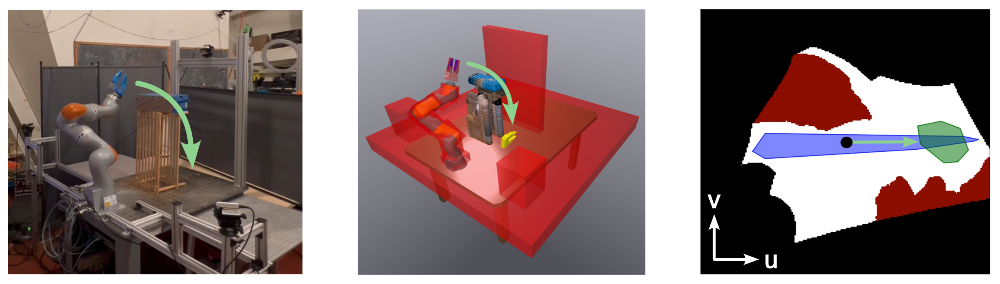

# CSDecomp: Configuration Space Decomposition Toolbox



CSDecomp is a Python package that implements a simple GPU-accelerated collision checker and GPU-accelerated algorithms for computing approximate convex decompositions of robot configuration spaces. The package provides implementations of Dynamic Roadmaps (DRMs) and the Edge Inflation Zero-Order (EI-ZO) algorithm in cuda/cpp as described in our paper ["Superfast Configuration-Space Convex Set Computation on GPUs for Online Motion Planning"](https://arxiv.org/pdf/2504.10783).

Since the publication I have continued adding useful functionality to this codebase for motion planning and have made it pip installable.

Contributions are welcome!
## Installation

### From PyPI (recommended)

```bash
pip install csdecomp
```

Requires an NVIDIA GPU with a compatible driver. The wheel bundles the CUDA runtime.

### From source

1. Install the CUDA toolchain (12.x recommended): https://developer.nvidia.com/cuda-toolkit-archive

    (Your display driver must be compatible with the installed CUDA version.)

2. Install prereqs:

    Install bazel via bazelisk:
    [bazelisk instructions](https://github.com/bazelbuild/bazelisk/blob/master/README.md)

    Other prereqs:
    `sudo bash setup.sh`

3. Build and test:

    `bazel test //...`

    (If you are getting cudaMalloc errors, make sure there aren't any big applications running in the background.)

### Usage

```python
import csdecomp as csd
```

The build also outputs a pip-installable wheel at `bazel-bin/csdecomp/src/pybind/csdecomp/`.

To change Python version, edit `tools/my_python_version.bzl` and `MODULE.bazel`.

The unit tests demonstrate how the code should be used. The Python bindings closely follow the C++ syntax.
There is experimental documentation that can be built with doxygen: `cd csdecomp/docs/ && doxygen Doxyfile`.

## Running the Examples

The examples require [uv](https://docs.astral.sh/uv/getting-started/installation/) for environment management.

### As a user (using the PyPI package)

```bash
cd examples
uv sync
uv pip install csdecomp
uv run python minimal_test.py
```

For notebooks:
```bash
uv run jupyter notebook
```
Select the `.venv` kernel in your editor.

### As a developer (using a locally built wheel)

```bash
cd examples
bash dev_install.sh          # builds wheel from source and installs it
uv run python minimal_test.py
uv run python test_eizo.py
uv run python test_drake_bridge.py
```

The example tests are also Bazel targets, so `bazel test //...` runs them alongside all other tests.

For notebooks, select the `.venv` kernel in your editor.

## Developing

Run the full test suite (requires GPU):

```bash
bazel test //...
```

CI runs lint and build checks only (no GPU required). Developers with a GPU should run the full suite locally before pushing.

For interactive debugging of C++ code with plotting, use the `cc_test_with_system_python` targets (tagged `manual`) in the test BUILD files. These require system Python with matplotlib and dev headers installed.

## Citation

If you find this code useful, please consider citing our paper:

```
@article{werner2024superfast,
  title={Superfast Configuration-Space Convex Set Computation on GPUs for Online Motion Planning},
  author={Werner, Peter and Cheng, Richard and Stewart, Tom and Tedrake, Russ and Rus, Daniela},
  journal={arXiv preprint arXiv:2504.10783},
  year={2025}
}
```

## Useful Commands

```bash
bazel build //...                                              # build everything
bazel build //csdecomp/src/pybind/csdecomp:csdecomp_wheel      # build pip wheel
bazel test //...                                               # run all tests (requires GPU)
bazel test //csdecomp/tests:csdecomp_test                      # run Python integration test
```

If Drake is slow to launch (LCM error):
```bash
sudo ifconfig lo multicast && sudo route add -net 224.0.0.0 netmask 240.0.0.0 dev lo
```